# RAGCore — Production RAG Chatbot

A production-ready Retrieval-Augmented Generation (RAG) pipeline over private PDF corpora.

## System Architecture Flow

The following diagram illustrates how documents are ingested and how user queries are processed end-to-end through the hybrid retrieval and generation pipelines.

```mermaid
graph TD
    %% Ingestion Pipeline %%
    subgraph Ingestion Pipeline
        A[PDF Documents] --> B[Text Extraction PyMuPDF]
        B --> C{Text Native?}
        C -- Yes --> D[Clean & Normalize Text]
        C -- No < 100 chars --> E[Tesseract OCR Fallback]
        E --> D
        D --> F[Recursive Token Chunking]
        F --> G[HuggingFace Embeddings BGE]
        G --> H[(Qdrant Vector Database)]
        F --> I[In-Memory BM25 Index]
    end

    %% Query Pipeline %%
    subgraph Query & Chat Pipeline
        J[User Question] --> K[Dense Query Embedding]
        J --> L[Sparse Term Scoring]
        K --> M[Qdrant ANN Vector Search]
        L --> N[BM25 Index Search]
        M --> O[Reciprocal Rank Fusion RRF]
        N --> O
        O --> P[Cross-Encoder Reranker]
        P --> Q[Construct Citation-Aware Prompt]
        Q --> R[LLM Generation: Gemini, OpenAI, Claude, Ollama]
        R --> S[Parse Grounded Citations & Sources]
        S --> T[JSON Response to Chat UI]
    end
```



---

## Step-by-Step Workflow

### 1. Document Ingestion
1. **Extraction**: Reads raw PDFs using `PyMuPDF` (fitz). If a page has fewer than 100 characters (e.g. scanned documents), it triggers `Tesseract OCR` to extract textual content.
2. **Chunking**: Chunks text recursively using a `cl100k_base` tiktoken tokenizer with `CHUNK_SIZE = 750` tokens and `CHUNK_OVERLAP = 150` tokens.
3. **Indexing**: 
   - Computes dense vector representations via the `BAAI/bge-base-en-v1.5` model and uploads them to the **Qdrant** database.
   - Builds a sparse keyphrase index using **BM25** in memory.

### 2. Hybrid Retrieval & Reranking
1. **Dual-Route Retrieval**:
   - **Dense Search**: Finds the top 20 documents matching the query semantically from Qdrant.
   - **Sparse Search**: Finds keyphrase matching documents from the BM25 index.
2. **Fusion**: Combines search rankings using **Reciprocal Rank Fusion (RRF)**.
3. **Reranking**: Scores the combined chunks with a cross-encoder model (`ms-marco-MiniLM-L-6-v2`) to choose the top 5 most relevant contexts.

### 3. Generation (Grounding & Citations)
1. **Prompt Assembly**: Constructs a system prompt enforcing that the LLM answers *only* using provided contexts and appends citations in the form of `[filename, p.N]`.
2. **LLM Inference**: Calls the configured LLM (e.g., Google Gemini, OpenAI GPT, Anthropic Claude, or local Ollama).
3. **Citation Validation**: Extracts and validates brackets citations before serving the final structured answer to the frontend.

---

## Stack
| Component | Technology |
|---|---|
| PDF Extraction | PyMuPDF (fitz) |
| OCR Engine | Tesseract + pytesseract |
| Dense Embeddings | BAAI/bge-base-en-v1.5 (HuggingFace) |
| Vector Store | Qdrant (Local Docker) |
| Sparse Scoring | In-memory BM25 |
| Reranker | ms-marco-MiniLM-L-6-v2 Cross-Encoder |
| LLM Provider | **Gemini (Default)** / OpenAI / Claude / Ollama (Configurable) |
| Backend Server | FastAPI (Python) |
| Frontend | Vanilla JS + HTML |

---

## Setup & Running

### 1. Configuration
Copy `.env.example` to `.env` and fill in your API keys (e.g. `GEMINI_API_KEY`):
```bash
cp .env.example .env
```
Ensure you select the provider in `.env`:
```env
LLM_PROVIDER=gemini
GEMINI_API_KEY=AIzaSy...
```

### 2. Start Services (Qdrant DB)
Start the Qdrant Docker container:
```bash
docker run -p 6333:6333 -v $(pwd)/qdrant_storage:/qdrant/storage qdrant/qdrant
```

### 3. Ingest Data
Place your PDF files under the `./pdfs` folder, and run:
```bash
python scripts/run_ingestion.py --pdf_dir ./pdfs --reset
```

### 4. Start Server
Run the FastAPI backend:
```bash
python backend/server.py
```
Open [http://localhost:8000](http://localhost:8000) in your web browser.
