# 🤖 RAGCore — Enterprise-Grade RAG Chatbot

[](https://www.python.org/)
[](https://fastapi.tiangolo.com/)
[](https://qdrant.tech/)
[](https://ai.google.dev/)
[](https://opensource.org/licenses/MIT)

A state-of-the-art Retrieval-Augmented Generation (RAG) pipeline designed for question-answering over private, high-volume PDF corpora with automatic citation grounding, hybrid retrieval, and OCR fallbacks.

---

## 🌟 Key Features

*   **⚡ Hybrid Dense-Sparse Retrieval**: Combines semantic embeddings (HNSW Dense Search via Qdrant) and exact keyword scoring (in-memory BM25 Search) using **Reciprocal Rank Fusion (RRF)**.
*   **🎯 Cross-Encoder Reranking**: Utilizes the `ms-marco-MiniLM-L-6-v2` cross-encoder to re-score the top merged contexts, dramatically improving retrieval precision.
*   **📷 Scanned PDF OCR Fallback**: Automatically invokes **Tesseract OCR** when native text extraction yields sparse characters, accommodating scanned papers and images.
*   **🌐 Flexible LLM Adapters**: Native support for **Google Gemini (Default)**, **OpenAI GPT**, **Anthropic Claude**, and local **Ollama** models.
*   **📝 Citation Grounding**: Prompts the LLM to output precise inline citations (e.g., `[filename, p.N]`) and parses them to guarantee factual accountability.

---

## 🗺️ Architectural Workflow

The diagram below details the ingestion pipeline and the end-to-end user query lifecycle.

```mermaid
graph TD
    %% Ingestion Pipeline %%
    subgraph Ingestion Pipeline [1. Document Ingestion]
        A[PDF Documents] --> B[Text Extraction PyMuPDF]
        B --> C{Text Native?}
        C -- Yes --> D[Clean & Normalize Text]
        C -- No < 100 chars --> E[Tesseract OCR Fallback]
        E --> D
        D --> F[Recursive Token Chunking]
        F --> G[HuggingFace Embeddings BGE]
        G --> H[(Qdrant Vector Database)]
        F --> I[In-Memory BM25 Index]
    end

    %% Query Pipeline %%
    subgraph Query Pipeline [2. Hybrid Retrieval & Generation]
        J[User Question] --> K[Dense Query Embedding]
        J --> L[Sparse Term Scoring]
        K --> M[Qdrant ANN Vector Search]
        L --> N[BM25 Index Search]
        M --> O[Reciprocal Rank Fusion RRF]
        N --> O
        O --> P[Cross-Encoder Reranker]
        P --> Q[Construct Citation-Aware Prompt]
        Q --> R[LLM Inference: Gemini, OpenAI, Claude, Ollama]
        R --> S[Parse Grounded Citations & Sources]
        S --> T[JSON Response to Chat UI]
    end
    
    style Ingestion Pipeline fill:#1a1c23,stroke:#3b82f6,stroke-width:2px;
    style Query Pipeline fill:#1a1c23,stroke:#10b981,stroke-width:2px;
```



---

## 📂 Project Directory Structure

```
rag-chatbot/
├── backend/
│   ├── ingest.py          # PDF ingestion and OCR processing pipeline
│   ├── embedder.py        # Embedding model loading and processing
│   ├── vector_store.py    # Interface wrapper for Qdrant Vector DB
│   ├── retriever.py       # Dense + sparse retriever with cross-encoder reranking
│   ├── generator.py       # Grounded citation LLM generator (Gemini, OpenAI, etc.)
│   └── server.py          # FastAPI web service endpoints
├── frontend/
│   └── index.html         # Rich Web Chat Interface
├── scripts/
│   ├── run_ingestion.py   # Command Line tool to ingest PDF directories
│   └── test_llm_connection.py # Connection debugger tool
├── config/
│   └── settings.py        # Application configuration settings
├── .gitignore             # Git exclusion rules (safeguarding API keys)
├── .env.example           # Shared environment configuration template
└── requirements.txt       # Project python dependencies list
```

---

## 🚀 Step-by-Step Setup Guide

### 1. Pre-requisites
Install Tesseract OCR on your system:
*   **Windows**: Download installer from [UB Mannheim](https://github.com/UB-Mannheim/tesseract/wiki).
*   **macOS**: `brew install tesseract`
*   **Ubuntu**: `sudo apt-get install tesseract-ocr`

### 2. Install Dependencies
```bash
pip install -r requirements.txt
```

### 3. Configure Environments
Copy the `.env.example` template to `.env`:
```bash
cp .env.example .env
```
Open `.env` and set your preferred provider and API keys:
```env
LLM_PROVIDER=gemini
GEMINI_API_KEY=your_google_studio_api_key
```

### 4. Start Services (Docker)
Ensure your Docker daemon is active, then start the Qdrant vector database:
```bash
docker run -p 6333:6333 -v $(pwd)/qdrant_storage:/qdrant/storage qdrant/qdrant
```

### 5. Ingest PDFs
Place your PDF files under the `./pdfs` folder, then run:
```bash
python scripts/run_ingestion.py --pdf_dir ./pdfs --reset
```

### 6. Start the RAG Chatbot
Launch the FastAPI server:
```bash
python backend/server.py
```
Open **[http://localhost:8000](http://localhost:8000)** in your browser to interact with the Chat UI.
