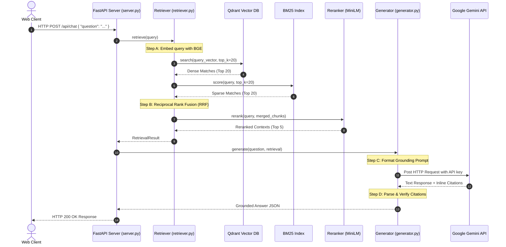

# 🤖 RAGCore — Enterprise-Grade RAG Chatbot

[](https://www.python.org/)
[](https://fastapi.tiangolo.com/)
[](https://qdrant.tech/)
[](https://ai.google.dev/)
[](https://opensource.org/licenses/MIT)

A state-of-the-art Retrieval-Augmented Generation (RAG) pipeline designed for question-answering over private, high-volume PDF corpora with automatic citation grounding, hybrid retrieval, and OCR fallbacks.

---

## 🏛️ Architecture Overview & Low-Level Design (LLD)

RAGCore is structured as a decoupled multi-tiered service separating document processing, vector embeddings index, hybrid retrieval, and context-grounded text generation.

### System Topology & Interfaces

```mermaid
graph TD
    %% Client Interface %%
    A[HTML/JS Web Client] <-->|HTTP POST /api/chat| B[FastAPI Web Server]
    A <-->|HTTP POST /api/ingest| B

    %% Backend Controllers %%
    subgraph core_system ["Core System Modules"]
        B --> C[PDF Ingestion Pipeline]
        B --> D[Hybrid Retriever]
        D --> E[Grounded Generator]
    end

    %% Data Providers %%
    subgraph data_providers ["Data & Inference Providers"]
        C -->|Raw Text / OCR| F[Sentence Embedder]
        F -->|768-dim Vectors| G[(Qdrant Vector DB)]
        C -->|Raw Chunks| H[In-Memory BM25 Sparse Index]
        D -->|Vector Search| G
        D -->|Keyphrase Search| H
        D -->|Candidate Rerank| I[Cross-Encoder Reranker]
        E -->|Grounded Context| J[LLM Api Client: Gemini/OpenAI/Claude]
    end
    
    style core_system fill:#1e1e24,stroke:#3b82f6,stroke-width:2px;
    style data_providers fill:#1e1e24,stroke:#10b981,stroke-width:2px;
```



---

### Low-Level Design (LLD) Module Descriptions

#### 1. Ingestion Pipeline (`backend/ingest.py`)
Responsible for reading raw PDF documents, extracting text content (with scanned page OCR fallback), cleaning formatting anomalies, and parsing headings.
*   **Key Classes & Data Structures**:
    ```python
    @dataclass
    class Chunk:
        chunk_id: str      # MD5 Hash + Page + Index
        pdf_id: str        # MD5 Hash of PDF file
        filename: str      # PDF Filename
        page: int          # Page Number (1-indexed)
        text: str          # Raw text snippet
        tokens: int        # Number of tiktoken tokens
        language: str      # ISO 2-character language code
        section: str       # Section heading parsed from text
        ocr_used: bool     # Flag indicating if OCR was triggered

    @dataclass
    class PDFMeta:
        pdf_id: str
        filename: str
        pages: int
        chunks: list[Chunk]
    ```
*   **Workflow**:
    `ingest_pdf(pdf_path)` -> Extract page text via `PyMuPDF` -> If char count < 100, execute `pytesseract` OCR -> `clean_text()` (unicode normalization and hyphen cleanup) -> `token_chunks()` (recursive chunking) -> Yield `PDFMeta`.

#### 2. Vector Embeddings (`backend/embedder.py`)
Provides thread-safe wrappers for HuggingFace embedding models.
*   **Key Interface**:
    ```python
    class Embedder:
        def embed_query(self, text: str) -> np.ndarray:
            # Prepends "Represent this question for searching relevant passages: " for BGE asymmetric retrieval
            ...
        def embed_passages(self, texts: list[str]) -> np.ndarray:
            ...
    ```

#### 3. Vector Database Provider (`backend/vector_store.py`)
Encapsulates CRUD interactions with the local Qdrant engine.
*   **Key Interface**:
    ```python
    class VectorStore:
        def upsert_chunks(self, chunks: list[dict]) -> int:
            # Batch uploads 768-dim payload vectors to Qdrant collection
            ...
        def search(self, query_vector: list[float], top_k: int) -> list[dict]:
            # HNSW Cosine Similarity search over Qdrant
            ...
    ```

#### 4. Hybrid Retriever & Reranker (`backend/retriever.py`)
Executes dense semantic queries, sparse keyword scoring, reciprocal rank fusion, and deep learning reranking.
*   **Key Classes & Data Structures**:
    ```python
    class BM25:
        # Lightweight in-memory Okapi BM25 indexer
        def score(self, query: str) -> list[tuple[int, float]]: ...

    class Reranker:
        # Cross-Encoder (ms-marco-MiniLM-L-6-v2) scorer
        def rerank(self, query: str, chunks: list[dict]) -> list[dict]: ...

    @dataclass
    class RetrievalResult:
        chunks: list[dict]       # Sorted top 5 reranked chunks
        dense_time_ms: float
        rerank_time_ms: float
        total_time_ms: float
        query: str
    ```

#### 5. Contextual LLM Generator (`backend/generator.py`)
Constructs citation-grounded LLM prompts, handles HTTP API calls to inference services, and validates output structure.
*   **Key Interface**:
    ```python
    class Generator:
        def generate(self, question: str, retrieval: RetrievalResult) -> dict:
            # formats user prompt -> makes HTTP request to Gemini/OpenAI -> parses inline citations
            ...
    ```

---

### End-to-End Chat Query Sequence Flow



---

## 🌟 Key Features

*   **⚡ Hybrid Dense-Sparse Retrieval**: Combines semantic embeddings (HNSW Dense Search via Qdrant) and exact keyword scoring (in-memory BM25 Search) using **Reciprocal Rank Fusion (RRF)**.
*   **🎯 Cross-Encoder Reranking**: Utilizes the `ms-marco-MiniLM-L-6-v2` cross-encoder to re-score the top merged contexts, dramatically improving retrieval precision.
*   **📷 Scanned PDF OCR Fallback**: Automatically invokes **Tesseract OCR** when native text extraction yields sparse characters, accommodating scanned papers and images.
*   **🌐 Flexible LLM Adapters**: Native support for **Google Gemini (Default)**, **OpenAI GPT**, **Anthropic Claude**, and local **Ollama** models.
*   **📝 Citation Grounding**: Prompts the LLM to output precise inline citations (e.g., `[filename, p.N]`) and parses them to guarantee factual accountability.

---

## 🛠️ Technology Stack (RAG Stack)

| Layer | Component | Technology | Description |
|---|---|---|---|
| **RAG Orchestrator** | Core Logic | **Custom Python RAG** | Lightweight, direct orchestration without heavy wrappers (like LangChain or LlamaIndex) to keep latency under target. |
| **Vector DB** | Knowledge Retrieval | **Qdrant** | Local HNSW-indexed vector database for ultra-fast dense semantic search. |
| **Dense Embeddings** | Representation | **BAAI/bge-base-en-v1.5** | High-accuracy HuggingFace encoder (768-dim) for asymmetric semantic retrieval. |
| **Sparse Index** | Keyphrase Match | **Okapi BM25** | In-memory lexical match system for exact keywords. |
| **Rank Fusion** | Hybrid Merging | **RRF (Reciprocal Rank Fusion)** | Fusion algorithm combining dense and sparse search rankings. |
| **Reranker** | Context Refinement | **ms-marco-MiniLM-L-6-v2** | Cross-encoder model to re-score the top merged snippets and choose the top 5. |
| **LLM Inference** | Response Generator | **Google Gemini 2.5/1.5** (Default) | Configurable HTTP adapters for Gemini, OpenAI, Claude, or local Ollama. |
| **PDF Extraction** | Data Source Parser | **PyMuPDF (fitz)** | Rapid native PDF text extraction. |
| **OCR Fallback** | Image-to-Text | **Tesseract OCR** | Automatic OCR when PDF text density is low (e.g., scanned documents). |
| **Web Service** | Interface API | **FastAPI** | High-performance async Python backend server. |
| **Frontend UI** | Presentation | **Vanilla HTML5 & JavaScript** | Responsive web client with real-time markdown and citation rendering. |

---

## 📂 Project Directory Structure

```
rag-chatbot/
├── backend/
│   ├── ingest.py          # PDF ingestion and OCR processing pipeline
│   ├── embedder.py        # Embedding model loading and processing
│   ├── vector_store.py    # Interface wrapper for Qdrant Vector DB
│   ├── retriever.py       # Dense + sparse retriever with cross-encoder reranking
│   ├── generator.py       # Grounded citation LLM generator (Gemini, OpenAI, etc.)
│   └── server.py          # FastAPI web service endpoints
├── frontend/
│   └── index.html         # Rich Web Chat Interface
├── scripts/
│   ├── run_ingestion.py   # Command Line tool to ingest PDF directories
│   └── test_llm_connection.py # Connection debugger tool
├── config/
│   └── settings.py        # Application configuration settings
├── .gitignore             # Git exclusion rules (safeguarding API keys)
├── .env.example           # Shared environment configuration template
└── requirements.txt       # Project python dependencies list
```

---

## 🚀 Step-by-Step Setup Guide

### 1. Pre-requisites
Install Tesseract OCR on your system:
*   **Windows**: Download installer from [UB Mannheim](https://github.com/UB-Mannheim/tesseract/wiki).
*   **macOS**: `brew install tesseract`
*   **Ubuntu**: `sudo apt-get install tesseract-ocr`

### 2. Install Dependencies
```bash
pip install -r requirements.txt
```

### 3. Configure Environments
Copy the `.env.example` template to `.env`:
```bash
cp .env.example .env
```
Open `.env` and set your preferred provider and API keys:
```env
LLM_PROVIDER=gemini
GEMINI_API_KEY=your_google_studio_api_key
```

### 4. Start Services (Docker)
Ensure your Docker daemon is active, then start the Qdrant vector database:
```bash
docker run -p 6333:6333 -v $(pwd)/qdrant_storage:/qdrant/storage qdrant/qdrant
```

### 5. Ingest PDFs
Place your PDF files under the `./pdfs` folder, then run:
```bash
python scripts/run_ingestion.py --pdf_dir ./pdfs --reset
```

### 6. Start the RAG Chatbot
Launch the FastAPI server:
```bash
python backend/server.py
```
Open **[http://localhost:8000](http://localhost:8000)** in your browser to interact with the Chat UI.
